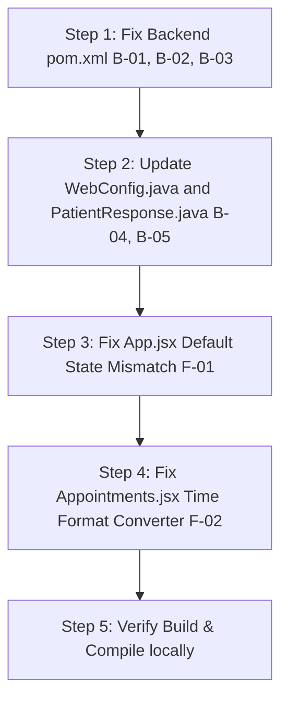

# CareSync Hospital Management System: Bug Diagnosis & Solutions Guide

This document presents a comprehensive diagnostic analysis of the bugs and configuration inconsistencies discovered in the CareSync Hospital Management System codebase. It details the root cause of each issue, its impact on the system, and the precise step-by-step solutions to resolve them.

---

## Executive Summary of Issues

The codebase is divided into a Spring Boot **Backend** and a Vite + React **Frontend**. Currently, the system is prevented from compiling or running successfully due to severe dependency misconfigurations in the backend, alongside critical state mismatch bugs in the frontend.

### Summary Table of Discovered Bugs

| ID | Component | Bug Description | Severity | Root Cause |
|---|---|---|---|---|
| **B-01** | Backend (`pom.xml`) | **Non-Existent Spring Boot Version (`4.0.6`)** | **Critical (Blocker)** | The parent version is set to `4.0.6` which does not exist, causing Maven to fail to resolve the parent POM and block all dependency retrieval. |
| **B-02** | Backend (`pom.xml`) | **Malformed Spring Starter Artifact Names** | **Critical (Blocker)** | Starter artifact names are misspelled (`spring-boot-starter-webmvc`, `spring-boot-starter-webmvc-test`, `spring-boot-h2console`), which prevents Maven from downloading core web/testing libraries. |
| **B-03** | Backend (`pom.xml`) | **Dead/Orphan JavaFX Config & Plugins** | **Low (Cleanup)** | Inclusion of JavaFX dependencies and plugins referencing a non-existent class `org.example.backend.JavaFxApplication`. |
| **B-04** | Backend (`WebConfig.java`) | **Unsafe CORS Configuration Injecting Nulls** | **Medium** | Spring `@Value` injection of CORS origins splits strings without null-safety or fallbacks, risking a crash at startup if environment variables are missing in production. |
| **B-05** | Backend (`PatientResponse.java`) | **Null Safety Risk in Embedded Vitals** | **Medium** | Reading `@Embedded` vitals without null-checks can result in `NullPointerException` during serialization/mapping. |
| **F-01** | Frontend (`App.jsx`) | **React State-Dropdown Mismatch (Intake Clinician)** | **High** | Default states for `newPatient.doctorName` and `newAppointment.doctorName` are hardcoded. If the user doesn't change the dropdown, the form submits the hardcoded values instead of the visually selected values. |
| **F-02** | Frontend (`App.jsx`) | **Appointment Time Format Inconsistency** | **Low** | `<input type="time">` yields 24h formats (`"14:30"`), whereas the seeded DB stores 12h formats with AM/PM (`"10:30 AM"`), leading to mixed visualization in the UI. |

---

## Detailed Bug Reports & Solutions

### 1. [Critical] B-01: Non-Existent Spring Boot Version (`4.0.6`)
* **File:** [pom.xml](file:///k:/Java/Hospital%20Management%20System/backend/pom.xml) (Lines 5–10)
* **Description:** The backend `pom.xml` configures the Spring Boot parent version as `<version>4.0.6</version>`. Since Spring Boot 4.x is not a released version, Maven is unable to pull the parent POM, rendering the entire backend build broken.
* **Impact:** The project will fail to import, resolve dependencies, compile, or build.
* **Solution:** Change the parent version to a stable and existing Spring Boot version, such as `3.3.5`, which matches the version used by other services in the `Microservices/` directory.

#### Code Diff:
```diff
     <parent>
         <groupId>org.springframework.boot</groupId>
         <artifactId>spring-boot-starter-parent</artifactId>
-        <version>4.0.6</version>
+        <version>3.3.5</version>
         <relativePath/> <!-- lookup parent from repository -->
     </parent>
```

---

### 2. [Critical] B-02: Malformed Spring Starter Artifact Names
* **File:** [pom.xml](file:///k:/Java/Hospital%20Management%20System/backend/pom.xml) (Lines 45–47, 82–85, 104–107)
* **Description:** The developer misspelled standard Spring Boot starter dependency artifacts:
  - `spring-boot-starter-webmvc` instead of `spring-boot-starter-web`
  - `spring-boot-starter-webmvc-test` instead of `spring-boot-starter-test`
  - `spring-boot-h2console` which does not exist as a standalone starter dependency (H2 Console is provided by H2 database and devtools).
* **Impact:** Maven fails to resolve dependencies and compile the code.
* **Solution:** Replace the malformed artifact IDs with standard Spring Boot artifact IDs.

#### Code Diff:
```diff
         <dependency>
             <groupId>org.springframework.boot</groupId>
-            <artifactId>spring-boot-starter-webmvc</artifactId>
+            <artifactId>spring-boot-starter-web</artifactId>
         </dependency>
...
-        <dependency>
-            <groupId>org.springframework.boot</groupId>
-            <artifactId>spring-boot-h2console</artifactId>
-            <scope>runtime</scope>
-        </dependency>
...
         <dependency>
             <groupId>org.springframework.boot</groupId>
-            <artifactId>spring-boot-starter-webmvc-test</artifactId>
+            <artifactId>spring-boot-starter-test</artifactId>
             <scope>test</scope>
         </dependency>
```

---

### 3. [Medium] B-04: Unsafe CORS Configuration Splitting (`WebConfig.java`)
* **File:** [WebConfig.java](file:///k:/Java/Hospital%20Management%20System/backend/src/main/java/org/example/backend/config/WebConfig.java) (Lines 10–14)
* **Description:** The CORS configuration relies on splitting `@Value("${app.cors.allowed-origins}")`. In `application-prod.properties`, this maps to `${CORS_ALLOWED_ORIGINS}`. If this environment variable is missing or empty in the production environment, the split operation will throw a runtime error, preventing the application context from starting.
* **Impact:** Application fails to boot in staging/production environments due to bean instantiation failure.
* **Solution:** Introduce a safe fallback value (`*` or localhost URL) directly inside the `@Value` placeholder to ensure the application starts even if environment variables are not fully configured.

#### Code Diff:
```diff
     private final String[] allowedOrigins;
 
-    public WebConfig(@Value("${app.cors.allowed-origins}") String allowedOriginsCsv) {
-        this.allowedOrigins = allowedOriginsCsv.split(",");
+    public WebConfig(@Value("${app.cors.allowed-origins:*}") String allowedOriginsCsv) {
+        this.allowedOrigins = allowedOriginsCsv != null && !allowedOriginsCsv.isBlank() 
+                ? allowedOriginsCsv.split(",") 
+                : new String[]{"*"};
     }
```

---

### 4. [Medium] B-05: Null Safety Risk in Embedded Vitals
* **File:** [PatientResponse.java](file:///k:/Java/Hospital%20Management%20System/backend/src/main/java/org/example/backend/patient/PatientResponse.java) (Line 35)
* **Description:** When serializing a patient, the system calls `VitalsResponse.from(patient.getVitals())`. If `vitals` is null (e.g. if the record is seeded programmatically or directly in the DB with null values), this immediately triggers a `NullPointerException`.
* **Impact:** Fetching patients will throw HTTP 500 error, crashing the dashboard.
* **Solution:** Wrap the conversion in a null-check and supply a safe null representation or fallback vitals.

#### Code Diff:
```diff
                 patient.getBedId() == null ? "None" : patient.getBedId(),
                 patient.getDoctorName(),
                 patient.getCheckInDate(),
-                VitalsResponse.from(patient.getVitals()),
+                patient.getVitals() == null ? null : VitalsResponse.from(patient.getVitals()),
                 patient.getDiagnosis(),
                 List.copyOf(patient.getPrescriptions())
```

---

### 5. [High] F-01: React State-Dropdown Mismatch (Intake Clinician Selection)
* **Files:** [App.jsx](file:///k:/Java/Hospital%20Management%20System/frontend/src/App.jsx) (Lines 33–40)
* **Description:** 
  - `newPatient.doctorName` is initialized to `'Dr. Maria Santos'`.
  - `newAppointment.doctorName` is initialized to `'Dr. Sarah Jenkins'`.
  - When the user opens the Patient Registration or Appointment booking modals, the `<select>` displays the list of active doctors fetched from the backend. The browser automatically renders the first doctor in the list as selected in the UI dropdown (e.g., `Dr. Sarah Jenkins` for patient intake).
  - If the user does not manually click the dropdown to change the clinician, they assume the displayed doctor is selected. However, the React state remains `'Dr. Maria Santos'` (or `'Dr. Sarah Jenkins'`). Submitting the form posts the wrong, hardcoded initial doctor name.
* **Impact:** Patients are assigned to the wrong doctors, causing severe data inconsistency in the clinic control board.
* **Solution:** When doctors are loaded from the backend inside the core `useEffect` block, dynamically update the default `doctorName` states to use the first doctor's name from the retrieved list.

#### Code Diff:
```diff
   const fetchAllData = useCallback(async () => {
     setLoading(true);
     setError(null);
     try {
       const [patientsData, doctorsData, bedsData, appointmentsData, activitiesData] = await Promise.all([
         patientsApi.getAll(),
         doctorsApi.getAll(),
         bedsApi.getAll(),
         appointmentsApi.getAll(),
         activitiesApi.getAll(),
       ]);
       setPatients(patientsData);
       setDoctors(doctorsData);
       setBeds(bedsData);
       setAppointments(appointmentsData);
       setActivities(activitiesData);
+
+      // Dynamically initialize form default doctors if doctor list is available
+      if (doctorsData && doctorsData.length > 0) {
+        const firstDocName = doctorsData[0].name;
+        setNewPatient(prev => ({ ...prev, doctorName: firstDocName }));
+        setNewAppointment(prev => ({ ...prev, doctorName: firstDocName }));
+      }
     } catch (err) {
       console.error('Failed to load data:', err);
       setError(err.message);
     } finally {
       setLoading(false);
     }
   }, []);
```

---

### 6. [Low] F-02: Appointment Time Format Inconsistency
* **Files:** [App.jsx](file:///k:/Java/Hospital%20Management%20System/frontend/src/App.jsx) & [Appointments.jsx](file:///k:/Java/Hospital%20Management%20System/frontend/src/components/Appointments.jsx)
* **Description:** The HTML `<input type="time">` yields 24-hour format strings (e.g., `"14:30"`). On the other hand, the seeded database entries use a 12-hour format with AM/PM (e.g., `"10:30 AM"`). This results in visual inconsistency in the Scheduler Panel, mixing both 12-hour and 24-hour formats.
* **Impact:** Poor UI aesthetics and layout inconsistency.
* **Solution:** Convert the 24-hour time string format returned by the HTML input element to a standard 12-hour AM/PM format before posting it to the backend API.

#### Time Converter Helper Function:
```javascript
const convertTo12HourFormat = (time24) => {
  if (!time24) return '';
  const [hours, minutes] = time24.split(':');
  let hours12 = parseInt(hours, 10);
  const ampm = hours12 >= 12 ? 'PM' : 'AM';
  hours12 = hours12 % 12 || 12; // convert 0 to 12
  return `${hours12}:${minutes} ${ampm}`;
};
```

Apply this helper in `handleBookAppointment`:
```javascript
  const handleBookAppointment = async (e) => {
    e.preventDefault();
    if (!newAppointment.patientName || !newAppointment.date || !newAppointment.time) return;

    try {
      await appointmentsApi.create({
        patientName: newAppointment.patientName,
        doctorName: newAppointment.doctorName,
        date: newAppointment.date,
        time: convertTo12HourFormat(newAppointment.time), // Format time cleanly
        reason: newAppointment.reason,
      });
      ...
```

---

### 7. [Low] B-03: Dead/Orphan JavaFX Config & Plugins
* **File:** [pom.xml](file:///k:/Java/Hospital%20Management%20System/backend/pom.xml)
* **Description:** The POM file includes heavy JavaFX packages (`javafx-controls`, `javafx-fxml`) and a `javafx-maven-plugin` configuration mapping to a main class `org.example.backend.JavaFxApplication`. There is no such class in the codebase, and the application is purely a Spring Boot REST API.
* **Impact:** Unnecessary dependencies that slow down build compilation and pollute classpath size.
* **Solution:** Safely remove JavaFX dependencies and the `javafx-maven-plugin` plugin block from `pom.xml`.

---

## Action Plan

Once you review and approve these findings, we can proceed with execution. Here is the recommended order of operations to solve all issues:



Please let me know if you would like me to proceed with implementing these fixes!
