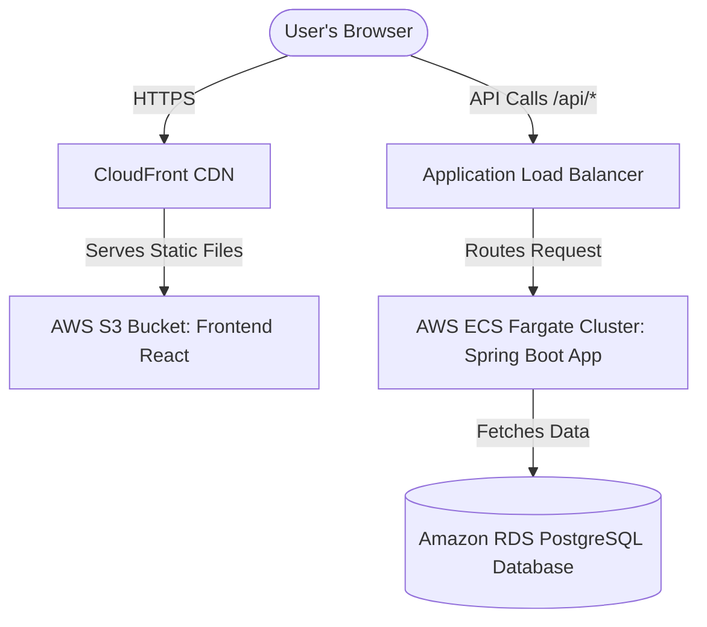

# Full-Stack Hospital Management System: Deployment Guide

This guide provides step-by-step instructions on **where** and **how** to deploy your full-stack application, which consists of a **Spring Boot backend** (configured for PostgreSQL) and a **React + Vite frontend**.

---

## 📋 Table of Contents
1. [Backend & Frontend Production Checklists](#1-backend--frontend-production-checklists)
2. [Hosting Platform Options (Where to Deploy)](#2-hosting-platform-options-where-to-deploy)
3. [Deployment Option A: Docker Compose on a VPS (Recommended)](#3-deployment-option-a-docker-compose-on-a-vps-recommended)
4. [Deployment Option B: PaaS (Railway / Render) (Easiest)](#4-deployment-option-b-paas-railway--render-easiest)
5. [Deployment Option C: Enterprise AWS Deployment](#5-deployment-option-c-enterprise-aws-deployment)
6. [🔐 Critical Security & Production Hardening Checklist](#6-critical-security--production-hardening-checklist)

---

## 1. Backend & Frontend Production Checklists

Before selecting a platform, we need to prepare both components to talk to each other in a production environment.

### A. React Frontend API Integration
Currently, the React frontend (`frontend/src/App.jsx`) uses **local mock states** (e.g., `initialPatients`). To run against your live deployed database and API:
1. **Create an API client configuration** in a new file `frontend/src/utils/api.js`:
   ```javascript
   const API_BASE_URL = import.meta.env.VITE_API_BASE_URL || '/api';
   
   export async function apiRequest(endpoint, options = {}) {
     const response = await fetch(`${API_BASE_URL}${endpoint}`, {
       headers: { 'Content-Type': 'application/json', ...options.headers },
       ...options,
     });
     if (!response.ok) throw new Error(`API Error: ${response.statusText}`);
     if (response.status === 204) return null; // No Content
     return response.json();
   }
   ```
2. **Replace state initializations** in `App.jsx` with `useEffect` calls fetching from `/api/patients`, `/api/doctors`, etc.
3. Use `import.meta.env.VITE_API_BASE_URL` to configure the backend API server location during build time.

### B. Spring Boot Backend Profiles
Your backend has a dedicated `prod` profile (`backend/src/main/resources/application-prod.properties`). In production, **always run with the `prod` profile** enabled by setting the environment variable:
```env
SPRING_PROFILES_ACTIVE=prod
```
The production profile maps data source variables to environment variables, which keeps secrets secure:
* `DB_URL` (e.g., `jdbc:postgresql://<host>:<port>/<db_name>`)
* `DB_USERNAME`
* `DB_PASSWORD`
* `CORS_ALLOWED_ORIGINS` (Must be set to your frontend's live production domain to prevent unauthorized access)

---

## 2. Hosting Platform Options (Where to Deploy)

Depending on your budget, devops experience, and scaling needs, choose one of these three hosting architectures:

| Platform | Difficulty | Est. Monthly Cost | Best For | Architecture |
| :--- | :--- | :--- | :--- | :--- |
| **VPS (DigitalOcean, Hetzner, Linode)** | **Medium** (requires terminal) | **$4 - $10** (Flat rate) | Hobbyists, Indie devs, Small clinics | All-in-one Virtual Machine running Docker Compose & Nginx |
| **PaaS (Railway, Render, Fly.io)** | **Easy** (Git-integrated UI) | **$7 - $20+** (Pay-as-you-go) | Quick launches, Zero-config DevOps | Containerized builds directly linked to Git, managed Postgres |
| **Enterprise Cloud (AWS, GCP)** | **Hard** (Steep learning curve) | **$30 - $100+** | Enterprise grade, high scalability | Static Vite on S3/CloudFront CDN, Spring Boot on ECS, Postgres on AWS RDS |

---

## 3. Deployment Option A: Docker Compose on a VPS (Recommended)

This approach is highly cost-effective, gives you total root control, and hosts your database, backend, and frontend together in isolated Docker containers.

### Step 1: Create a Production Multi-Stage Dockerfile for the Frontend
Create `frontend/Dockerfile.prod` to compile the React app and serve it using Nginx:
```dockerfile
# Stage 1: Build static React files
FROM node:20-alpine AS build
WORKDIR /app
COPY package*.json ./
RUN npm ci
COPY . .
# Inject production API base url (or leave empty to let Nginx reverse-proxy resolve /api locally)
ENV VITE_API_BASE_URL=/api
RUN npm run build

# Stage 2: Serve using Nginx
FROM nginx:alpine
COPY --from=build /app/dist /usr/share/nginx/html
COPY nginx.conf /etc/nginx/conf.d/default.conf
EXPOSE 80
CMD ["nginx", "-g", "daemon off;"]
```

### Step 2: Create the Frontend Nginx Configuration
Create `frontend/nginx.conf` to direct routing and reverse-proxy `/api` requests to the Spring Boot container:
```nginx
server {
    listen 80;
    server_name localhost;

    location / {
        root /usr/share/nginx/html;
        index index.html index.htm;
        try_files $uri $uri/ /index.html;
    }

    # Reverse proxy backend API calls to the Spring Boot service container
    location /api {
        proxy_pass http://backend:8080/api;
        proxy_set_header Host $host;
        proxy_set_header X-Real-IP $remote_addr;
        proxy_set_header X-Forwarded-For $proxy_add_x_forwarded_for;
        proxy_set_header X-Forwarded-Proto $scheme;
    }
}
```

### Step 3: Create the Root `docker-compose.yml`
Create a master `docker-compose.yml` in your project's **root directory** to orchestra the database, Spring Boot app, and the React frontend:

```yaml
version: '3.8'

services:
  # 1. PostgreSQL Database Service
  postgres-db:
    image: postgres:16-alpine
    container_name: hospital-db
    restart: always
    environment:
      POSTGRES_DB: hospital_management
      POSTGRES_USER: hospital_admin
      POSTGRES_PASSWORD: SecureProdPasswordChangeMe!
    volumes:
      - pgdata:/var/lib/postgresql/data
    ports:
      - "5432:5432"
    healthcheck:
      test: ["CMD-SHELL", "pg_isready -U hospital_admin -d hospital_management"]
      interval: 10s
      timeout: 5s
      retries: 5

  # 2. Spring Boot Backend Service
  backend:
    image: eclipse-temurin:25-jre
    container_name: hospital-backend
    restart: always
    depends_on:
      postgres-db:
        condition: service_healthy
    volumes:
      - ./backend/target/backend-0.0.1-SNAPSHOT.jar:/app/app.jar
    working_dir: /app
    entrypoint: ["java", "-jar", "app.jar"]
    environment:
      - SPRING_PROFILES_ACTIVE=prod
      - SERVER_PORT=8080
      - DB_URL=jdbc:postgresql://postgres-db:5432/hospital_management
      - DB_USERNAME=hospital_admin
      - DB_PASSWORD=SecureProdPasswordChangeMe!
      - CORS_ALLOWED_ORIGINS=http://localhost,https://yourdomain.com
    expose:
      - "8080"

  # 3. React Frontend Service (Served via Nginx)
  frontend:
    build:
      context: ./frontend
      dockerfile: Dockerfile.prod
    container_name: hospital-frontend
    restart: always
    ports:
      - "80:80"
    depends_on:
      - backend

volumes:
  pgdata:
```

> [!NOTE]
> Ensure your backend is packaged (`mvnw clean package -DskipTests`) before launching this docker-compose file, as it mounts the local target JAR into the container!

### Step 4: Run on your Server
1. Rent a VPS (Ubuntu) from DigitalOcean or Hetzner.
2. Direct your domain DNS `A` records to the VPS IP address.
3. Install Docker and Docker Compose on the VPS:
   ```bash
   sudo apt update
   sudo apt install docker.io docker-compose -y
   ```
4. Git clone your repository onto the server.
5. Compile backend targets:
   ```bash
   cd backend && ./mvnw clean package -DskipTests && cd ..
   ```
6. Build and launch:
   ```bash
   docker-compose up --build -d
   ```
7. Set up SSL using Certbot (Let's Encrypt) to map HTTPS to port 80.

---

## 4. Deployment Option B: PaaS (Railway / Render) (Easiest)

Platforms like **Railway** or **Render** automatically watch your GitHub repository, build both images, and run them with zero Linux configurations.

### Step-by-Step for Railway:
1. **Create a Database**:
   * Log into [Railway.app](https://railway.app/).
   * Click **New Project** -> **Provision PostgreSQL**.
   * Railway creates the database and generates an internal connection string (available under the `Variables` tab as `DATABASE_URL`).
2. **Deploy the Spring Boot Backend**:
   * Click **New** -> **GitHub Repo** -> select your project.
   * Under settings, set the **Root Directory** of the service to `/backend`.
   * Add the following environment variables in the service dashboard:
     * `SPRING_PROFILES_ACTIVE` = `prod`
     * `SERVER_PORT` = `8080`
     * `DB_URL` = `jdbc:postgresql://${{Postgres.DATABASE_URL}}` *(Automatically references your Railway PG container!)*
     * `DB_USERNAME` = `${{Postgres.PGUSER}}`
     * `DB_PASSWORD` = `${{Postgres.PGPASSWORD}}`
     * `CORS_ALLOWED_ORIGINS` = `<Your-Live-Frontend-Url>`
   * Railway will auto-detect the backend's `Dockerfile` and boot it.
3. **Deploy the React Frontend**:
   * Click **New** -> **GitHub Repo** -> select the project.
   * Under settings, set the **Root Directory** of the service to `/frontend`.
   * Set **Build Command** to `npm run build` and **Start/Publish Directory** to `dist` (if deployed as a static web site) or use a static site provider.
   * Add Environment Variable:
     * `VITE_API_BASE_URL` = `<Your-Live-Backend-Railway-Url>`
   * Railway builds the static SPA and gives you a free `.up.railway.app` SSL domain.

---

## 5. Deployment Option C: Enterprise AWS Deployment

For fully resilient, secure, and production-grade hosting, use AWS cloud services.



### 1. Database (RDS PostgreSQL)
* Create a private PostgreSQL Instance in Amazon RDS.
* Configure it to only accept traffic on port `5432` from your backend's Security Group.

### 2. Frontend (S3 + CloudFront CDN)
* Build the React bundle locally or via CI/CD pipelines: `npm run build`.
* Upload the contents of `/dist` to an **Amazon S3 bucket** configured for Static Website Hosting.
* Attach **Amazon CloudFront** to the S3 bucket to serve assets worldwide with HTTPS SSL certificates via AWS Certificate Manager (ACM).

### 3. Backend (AWS ECS Fargate)
* Build your backend as a Docker Image:
  ```bash
  docker build -t hospital-backend ./backend
  ```
* Push your image to **Amazon ECR** (Elastic Container Registry).
* Create an **AWS ECS Cluster** using **AWS Fargate** (serverless container management).
* Set up an **Application Load Balancer (ALB)** in front of your container instances to distribute traffic and handle HTTPS decryption.
* Pass production environment variables (`DB_URL`, database credentials) securely using **AWS Systems Manager (SSM) Parameter Store** or **Secrets Manager**.

---

## 6. 🔐 Critical Security & Production Hardening Checklist

> [!WARNING]
> Your Spring Boot backend currently lacks an Authentication & Authorization layer (no login or token validation). **Deploying this application directly to the open internet in its current state is insecure** as anyone would be able to register patients, view medical vitals, delete appointments, or access sensitive hospital directories.

Ensure these steps are taken before opening access:

- [ ] **Add Security Layer**: Integrate `spring-boot-starter-security` and deploy OAuth2, JWT tokens, or Session-based login so only authenticated staff can access `/api/*` endpoints.
- [ ] **Restrict CORS**: Never deploy with `CORS_ALLOWED_ORIGINS=*` or local domains. Set it strictly to your production frontend URL (e.g. `https://hospital.yourdomain.com`).
- [ ] **Secure Secret Properties**: Never commit production passwords or credentials into `application-prod.properties` or Git. Use environment variables (like `${DB_PASSWORD}`) that are populated by your hosting environment at runtime.
- [ ] **SSL (HTTPS)**: Ensure all connections between your users, the frontend, and the backend use TLS/HTTPS to protect medical records in transit.
- [ ] **Flyway Migration Schema**: Confirm Flyway is run with `spring.jpa.hibernate.ddl-auto=validate` so no accidental table wipes occur. Keep a regular automated database backup (snapshots) schedule active.
